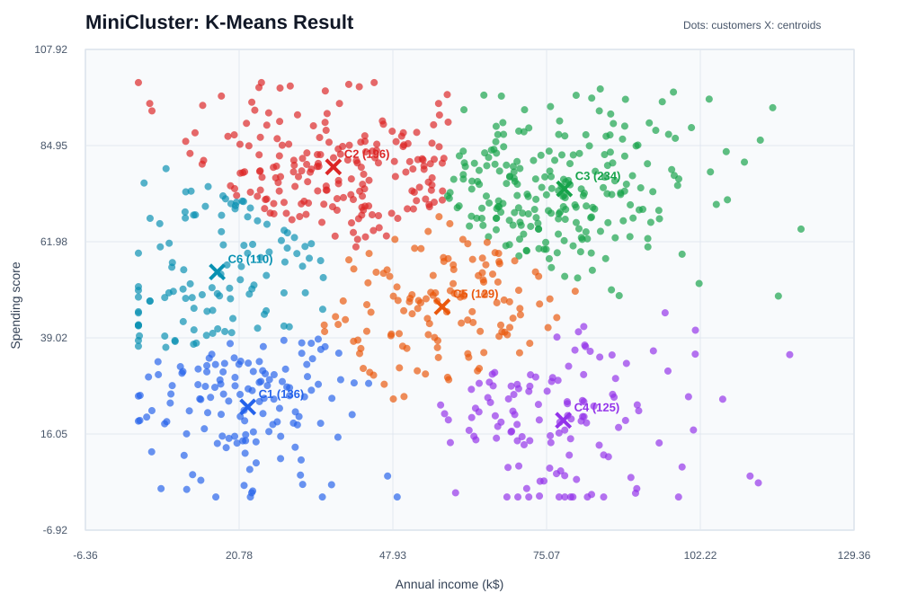

# MiniCluster

MiniCluster is a dependency-free C++17 implementation of **2D K-Means clustering**. It groups unlabeled customer records using annual income and spending score, then explains the result with quality metrics, outlier detection, CSV export, an ASCII map, and an SVG scatter plot.

This is intentionally an analysis tool rather than an algorithm snippet: initialization is interchangeable, experiments are repeatable, difficult cases are handled defensively, and the result is easy to present.

## Example result

The plot below was generated from the included 930-record customer dataset using `k = 6` and K-Means++ initialization. Each dot is a customer, colour is its final cluster, and an `X` marks the cluster centroid.



The data has overlapping, unevenly spread profiles rather than perfectly circular groups. That makes the cluster boundaries and diagnostics worth discussing in a project presentation.

## Features

- **Pluggable initialization:** random and K-Means++ strategies implement the `CentroidInitializer` interface.
- **Reproducible results:** a configurable seed makes runs easy to repeat and compare.
- **Robust convergence:** tolerance and iteration guards, plus empty-cluster recovery.
- **Diagnostics:** inertia, silhouette score, cluster size, average/max radius, and outlier candidates.
- **Visual output:** ASCII map, point-assignment CSV, and presentation-ready SVG plot.
- **Zero dependencies:** builds with a standard C++17 compiler and `make`; CMake is not used.

## The K-Means algorithm

Let `X = {x_1, x_2, ..., x_n}` be the dataset. Each customer is a two-dimensional point:

```text
x_i = (annual_income_i, spending_score_i)
```

For a selected number of clusters `k`, the algorithm finds centroids `mu_1, mu_2, ..., mu_k` that make members of each cluster close to one another.

### 1. Distance between customers

MiniCluster uses Euclidean distance. For points `p = (p_x, p_y)` and `q = (q_x, q_y)`:

```text
distance(p, q) = sqrt((p_x - q_x)^2 + (p_y - q_y)^2)
```

During assignment, the implementation uses squared distance. It identifies the same nearest centroid while avoiding unnecessary square-root calculations:

```text
squaredDistance(p, q) = (p_x - q_x)^2 + (p_y - q_y)^2
```

### 2. Initialize centroids

The starting positions affect the local optimum that K-Means reaches.

**Random initialization** samples `k` distinct input points. It is useful as a baseline but can choose nearby initial centroids.

**K-Means++** selects the first centroid at random. Each following centroid is selected with probability proportional to its squared distance from the closest already-selected centroid:

```text
P(x_i is chosen) = D(x_i)^2 / sum(D(x_j)^2)
```

`D(x_i)` is the distance from `x_i` to its nearest selected centroid. This spreads seeds through the data and generally produces more stable clusters.

### 3. Assign points to the nearest centroid

Every customer is assigned to the closest centroid:

```text
cluster(x_i) = argmin_j squaredDistance(x_i, mu_j)
```

The code stores original point indices in each `Cluster`, allowing later diagnostics and CSV export without copying the input data.

### 4. Recalculate centroid positions

For cluster `C_j`, its new centroid is the arithmetic mean of all members:

```text
mu_j = (1 / |C_j|) * sum(x_i), for every x_i in C_j
```

In this project, that means averaging annual income and spending score separately.

### 5. Repeat until convergence

The assignment and update steps repeat until the largest centroid movement is below the configured tolerance (`0.0001` by default), or the maximum iteration count is reached:

```text
max_j distance(old_mu_j, new_mu_j) <= tolerance
```

If a cluster becomes empty, MiniCluster moves its centroid to a poorly represented point. That prevents division by zero and lets the model recover instead of emitting an invalid result.

## Metrics and diagnostics

### Inertia: compactness

Inertia is the objective K-Means minimizes: the total squared distance of every point from its assigned centroid.

```text
inertia = sum_j sum_(x_i in C_j) squaredDistance(x_i, mu_j)
```

For the same dataset and `k`, smaller inertia means tighter clusters. Do not compare inertia alone across different `k` values, since adding clusters nearly always lowers it.

### Silhouette score: separation versus overlap

For a point `i`, let `a(i)` be its average distance to members of its own cluster. Let `b(i)` be the smallest average distance to another cluster. The silhouette value is:

```text
s(i) = (b(i) - a(i)) / max(a(i), b(i))
```

The program reports the average `s(i)` across all points.

| Score | Meaning |
| --- | --- |
| Near `1` | Compact, clearly separated clusters |
| Near `0` | Overlap or points near cluster boundaries |
| Below `0` | A point may fit another cluster better |

The included varied dataset usually gives a moderate score, which is expected because its customer profiles overlap.

### Radius and outlier candidates

For each cluster, the report gives the average and maximum distance from its centroid. A point is flagged when its distance is at least `2.5` standard deviations above its cluster's mean distance:

```text
z_i = (distance(x_i, mu_j) - mean_j) / standardDeviation_j
outlier when z_i >= 2.5
```

This is an investigation cue, not a claim that a customer record is wrong.

## Dataset

`data/mall_customers_large.csv` contains **930 synthetic customer records** with these columns:

```text
annual_income_k,spending_score
```

It combines six profiles with different variance and income/spending correlation, along with 30 atypical customers. The profiles intentionally overlap, and the data contains no personal information.

## Build and test

```bash
make
make test
```

`make` creates `build/minicluster`. `make test` compiles and runs the deterministic regression test.

## Run the project

Run the realistic dataset with six clusters:

```bash
./build/minicluster --input data/mall_customers_large.csv --k 6 --init kmeans++ --seed 42 --map
```

Generate the graph and point-assignment CSV:

```bash
./build/minicluster \
  --input data/mall_customers_large.csv \
  --k 6 \
  --init kmeans++ \
  --seed 42 \
  --graph cluster_plot.svg \
  --export cluster_assignments.csv
```

Compare initialization strategies with the same seed:

```bash
./build/minicluster --input data/mall_customers_large.csv --k 6 --init random --seed 42
./build/minicluster --input data/mall_customers_large.csv --k 6 --init kmeans++ --seed 42
```

## Command-line options

| Option | Purpose |
| --- | --- |
| `--input file.csv` | Load the first two numeric columns of a CSV, TSV, or semicolon-delimited file |
| `--demo` | Generate a small built-in example dataset |
| `--k N` | Number of clusters |
| `--init random\|kmeans++` | Centroid initialization strategy |
| `--seed N` | Reproducible random seed |
| `--max-iterations N` | Maximum assignment/update rounds |
| `--map` | Print an ASCII scatter map |
| `--graph file.svg` | Save a color-coded SVG scatter plot |
| `--export file.csv` | Save `point_id,x,y,cluster` assignments |

## Project structure

```text
include/data_point.h     2D point type and distance operations
include/initializers.h   Initializer interface and implementations
include/kmeans.h         Cluster type and K-Means public API
include/analytics.h      Silhouette, compactness, and outlier calculations
include/chart.h          SVG graph export interface
src/                     Algorithm, CSV, diagnostics, graph, and CLI code
data/                    Synthetic customer datasets
docs/                    README visual assets
tests/                   Deterministic regression test
```

## Complexity and limitations

Each K-Means iteration is approximately `O(n * k * d)`, where `n` is the number of records, `k` is the number of clusters, and `d = 2` dimensions here. Silhouette calculation is roughly `O(n^2)` because it compares point-to-point distances; that is still practical for this 930-record dataset.

K-Means works best for roughly compact, similarly scaled groups. Normalize features before using data with very different numeric ranges. The algorithm is sensitive to outliers and requires choosing `k`, so use inertia, silhouette score, and domain knowledge together rather than relying on one metric.
