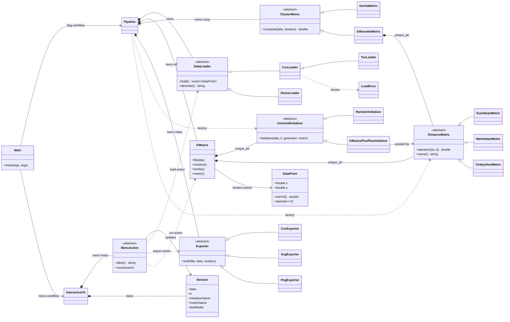

# MiniCluster

MiniCluster is a dependency-free C++17 application for **2D K-Means clustering**. It groups customer records using annual income and spending score, reports clustering quality, flags unusual points, exports CSV/SVG/PNG results, and provides both flag-based and interactive workflows.

The project is deliberately structured to demonstrate object-oriented design: every extensible concern is represented by a focused abstract base class and selected at runtime through polymorphism.

## Highlights

- K-Means with **random** or **K-Means++** centroid initialization.
- Euclidean, Manhattan, and Chebyshev distance metrics.
- Polymorphic CSV/TSV/demo data loaders with flexible column selection and strict parsing.
- Inertia and silhouette metric objects, cluster diagnostics, and outlier detection.
- CSV, SVG, and PNG exporters using RAII and `std::unique_ptr` ownership.
- Interactive terminal menu with safe input handling and a normal command-line workflow.
- No third-party dependencies and no CMake: build with a plain C++17 compiler and `make`.

## Architecture



## Build and test

```bash
make
make test
```

`make test` runs distance-metric tests, polymorphic initializer tests, CSV loader tests for header/semicolon/CRLF/bad-row/missing-file cases, golden K-Means regressions, and scripted interactive-menu tests.

## Command-line usage

Run the included 930-record dataset with the compatibility configuration:

```bash
./build/minicluster \
  --input data/mall_customers_large.csv \
  --k 6 --init kmeans++ --metric euclidean --seed 42 \
  --graph cluster_plot --export cluster_assignments.csv
```

This writes `cluster_plot.svg`, `cluster_plot.png`, and `cluster_assignments.csv`.

| Option | Meaning |
| --- | --- |
| `--input FILE` | CSV/TSV input file |
| `--demo` | Use the built-in synthetic customer data |
| `--k N` | Number of clusters |
| `--init random\|kmeans++` | Centroid initialization strategy |
| `--metric euclidean\|manhattan\|chebyshev` | Distance metric used for assignment and diagnostics |
| `--seed N` | Deterministic random seed |
| `--max-iterations N` | Iteration safety limit |
| `--x-col N`, `--y-col N` | Zero-based input-column indexes |
| `--delimiter C` | Explicit `,`, `;`, or tab delimiter |
| `--no-header` | Interpret the first content row as data |
| `--strict` | Stop on invalid rows instead of warning and skipping them |
| `--export FILE` | Write point-to-cluster assignments as CSV |
| `--graph BASE` | Write `BASE.svg` and `BASE.png` |
| `--interactive` | Open the interactive menu |

## Interactive mode

Start it with no arguments or explicitly with:

```bash
./build/minicluster --interactive
```

The menu can load data, set `k`, choose initializer/metric, set a seed, run clustering, inspect outliers, export one result, and compare initializers with the same seed. It validates every prompt and returns friendly messages when an operation needs data or a finished run.

Example session:

```text
MiniCluster interactive mode
1. Load data
2. Set k
3. Choose initializer
...
Choice: 1
File path: data/mall_customers_large.csv
X column [0]:
Y column [1]:
Delimiter (auto, comma, semicolon, tab) [auto]:
Loaded 930 rows from CSV data from data/mall_customers_large.csv.

Choice: 2
Number of clusters [6]: 6
Choice: 3
Initializer [kmeans++]: kmeans++
Choice: 5
Seed (Enter keeps current) [42]: 42
Choice: 6
Iterations: 46 | converged: yes | inertia: 211729.084 | silhouette: 0.398
```

## How the algorithm works

For every customer `x_i`, K-Means assigns it to the nearest centroid `mu_j`, recalculates each centroid as the average of its members, then repeats until centroids move less than the tolerance or the iteration limit is reached.

```text
cluster(x_i) = argmin_j metric(x_i, mu_j)
mu_j = (1 / |C_j|) * sum(x_i in C_j)
```

Euclidean assignment uses the equivalent squared value internally where appropriate. That avoids unnecessary square roots while preserving which centroid is nearest. If a cluster becomes empty, its centroid is moved to the worst-represented point so averaging never divides by zero.

**Inertia** is the sum of squared Euclidean distances from points to their assigned centroid. **Silhouette** compares a point's average distance inside its own cluster to its nearest other cluster. Outlier candidates are points whose distance from their own centroid is at least 2.5 standard deviations above their cluster's average.

## Project structure

```text
include/data_point.h       2D value type and arithmetic
include/distance_metric.h  DistanceMetric hierarchy and factory
include/initializers.h     CentroidInitializer hierarchy and factory
include/kmeans.h           Core K-Means model
include/analytics.h        ClusterMetric hierarchy and diagnostics helper
include/data_loader.h      DataLoader hierarchy and CSV options
include/exporter.h         CSV/SVG/PNG exporter hierarchy
include/interactive_cli.h  Menu actions and session-driven CLI
include/pipeline.h         Non-interactive load-fit-report-export pipeline
src/                       Implementations
tests/test_kmeans.cpp      Regression and integration coverage
data/                      Synthetic customer CSV datasets
docs/                      Plot assets used by documentation
```
